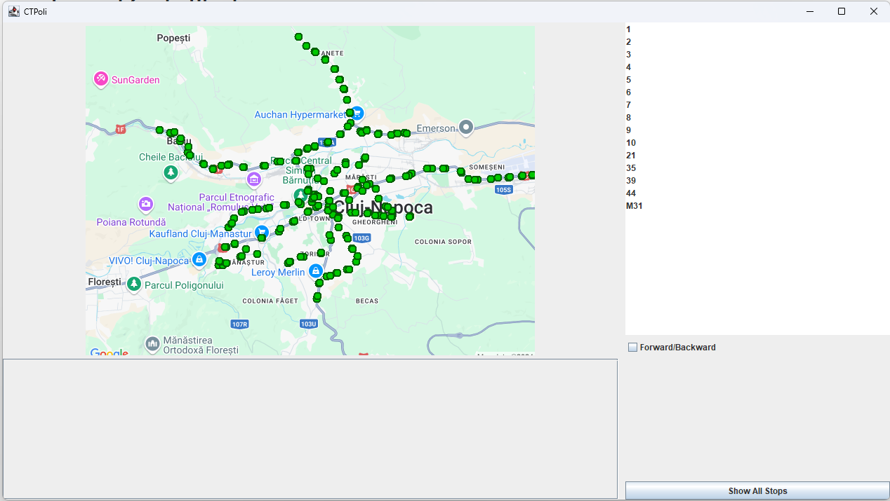
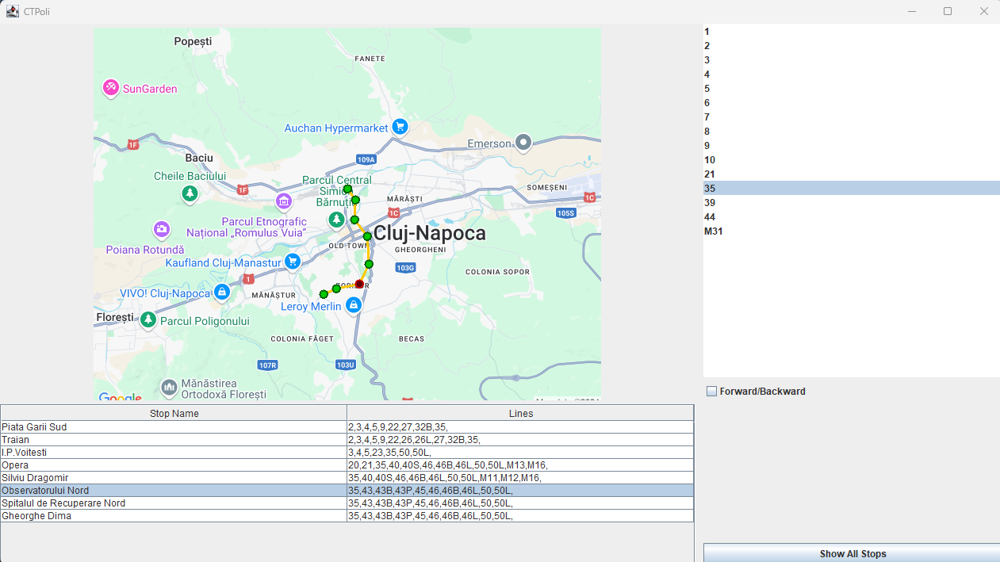

# CTPoli

### Public Transport Visualiser, in Cluj-Napoca

## App Setup requirements

- Load the code from the GitHub repository [here][repo]

- Load the Database driver file for postgresql version 42.7.4 to the project libraries, cf. file "postgresql-42.7.3.jar"

- Import from Maven library password4j version 1.8.2

- Java version of the SDK is correto-21

- Create a postgresql database with the name CTPoli, and two tables named "lines" and "stops" according to this specification:
```
CREATE TABLE stops
(
    id int4 NOT NULL,
    name VARCHAR(50) NOT NULL,
    latitude DOUBLE PRECISION NOT NULL,
    longitude DOUBLE PRECISION NOT NULL,
    lines VARCHAR(128)
);
CREATE TABLE lines
(
    number VARCHAR(5) NOT NULL,
    stopsForward VARCHAR(256),
    stopsBackward VARCHAR(256)
);
CREATE TABLE users 
(
    id serial4,
    username VARCHAR(20),
    password VARCHAR(64)
);
```

- Import the data from files "stops.csv" and "lines.csv" into their respective tables, setting the first row as a header

- If the connection to the database is working, by this point the code should be good to go

# The Application

After logging in, the app should look something like this:



Here we can see the main screen, and attracting our attention is a picture of the great city of Cluj-Napoca and no less than 206 bus stations in a bright and confident green

On the right of the screen, we have a list of 15, manually curated, accurate bus lines that span almost the entirety of the city, some going even further than the administrative borders of the mayor's jurisdiction.

The user can select a line from the list, and the route of the bus with the selected number will be shown on the map, with the option to choose the direction of the route with the button labeled "Forward/Backward", checked meaning Forward, and unchecked meaning Backward.



By selecting a line, the list of the stops in the route will be displayed under the map, with the option to select one or many stops that will be highlighted in red, making it easy to identify any specific station. The table also displays, besides the stops' name, all the other lines that pass through it, showing the user the common lines that can be taken at a specific stop.

If at any point you get bored of seeing routes on your screen, you can press the "Show All Stops" button on the bottom right of the screen, which will take you back to the main view with all the stops shown on the map, allowing you to admire the Public Transit system in all its glory.


### Fun fact

If you sweep rapidly between the lines while holding down the click, you will see that all of the lines rotate roughly around the `Mihai Viteazu` area, although many lines do not pass directly through that area, but still close to it, on streets like Memorandumului.

## Notes

- I left out the implementation of path finding between two stations because the task turned to be quite difficult, while being mostly an algorithmical problem considerably more than a programming one. If I had implemented it here's how I would have approached it, and these are also the reasons why it is more difficult than I thought:
    - Do an alternative BFS between the stations in a route, because you would have to change as few busses as possible, and switch only if necessary, then continue the search from the closest station to the destination with another bus. You would probably have to do this with all the posibilities and select the shortest valid path
    - Form an equivalency list of stations, that being because there are many symmetric stops (one on the other side of the street as the other), and also places like Mihai Viteazu or the Train Station where you could change the station by foot and take a bus from a different place to continue your route. So a lot of alternating through data structures to calculate a route, so a **lot** of time spent on the design of the algorithm

- The data gathering process was a quite tedious and demanding one, having to curate all the information by hand, that being all the stops names, coordinates on map, passing lines, and every line's order of stops, both forward and backward, being encoded in a unique identification for each stop, that being the id present in the database.<br>This was done both for efficiently encoding the routes, and for a unique indentification between stops, other than their names, making the code a bit cleaner.

- The map projection class, that works by taking the real world coordinates of a point on the globe and mapping it to pixel locations on the map on the screen.<br><br>To do this I turned to some maths. But before that, I took the coordinates of two specific points on the map, that being a point on the very left edge of the screen, and another on the very bottom edge of it. The center point was the point with which the API call to Static Google Maps was done. With those points, it calculates the latitude and longitude range that is visible on the map, and also the top left point, which is the (0,0) pixel on the map.<br><br>Having a range of coordinates visible on the map and the size of the displayed image (which you can also scale and display the routes correctly by the way), the final step was to map a range of values onto another. More details about the math in the code comments.<br>`This method of linearly mapping a region of the globe was feasible because the image doesn't cover a large area of the planet, so the distortion caused by projecting a sphere onto a plane is neglibible in this case. The alternative is to use the mercator projection, which is also used in most consumer globe mapping applications. Google Maps upgraded to a globe because they are very smart and they have money.`

- Other UI functionality is displaying the lines for both directions of travel, displaying the stops with their respective lines that visit them, being able to highlight bus stops, both individual and an interval of them, drawing the lines between the stops for a route

- Other than that, it is a matter of implementation, and other details are in the code comments. The painting system was interesting to use.

> Happy bus riding

[repo]: https://github.com/Deblisus/David_Rafael_Rotar_CTPoli.git